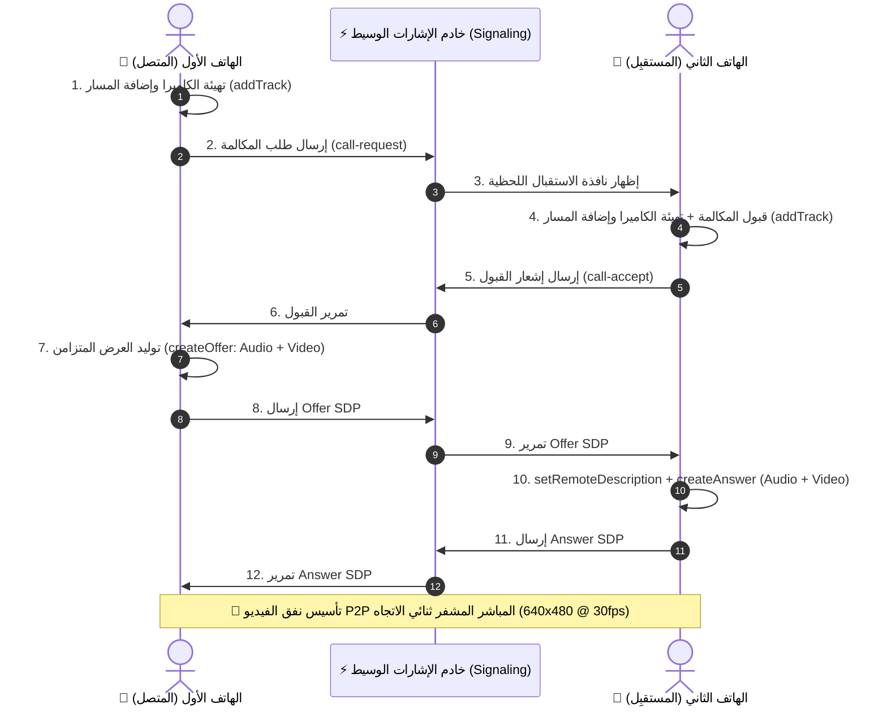
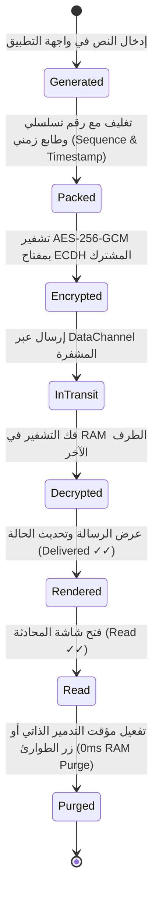
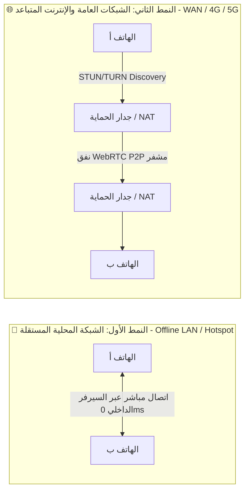

# 🛡️ Zero-Trace: Ephemeral P2P Encrypted Engine & WebRTC Communications
<p align="center">
  
  
  
  
</p>

---

## 📑 الفهرس / Table of Contents
1. [🌟 نظرة عامة على النظام / System Overview](#-نظرة-عامة-على-النظام--system-overview)
2. [🏗️ المخططات الهندسية الشاملة / System Architecture & Flowcharts](#️-المخططات-الهندسية-الشاملة--system-architecture--flowcharts)
3. [🌐 الطوبولوجيا وهندسة الشبكات / Network Topology & NAT Traversal](#-الطوبولوجيا-وهندسة-الشبكات--network-topology--nat-traversal)
4. [🔐 منظومة التشفير والخصوصية الرقمية / Cryptographic & Privacy Engine](#-منظومة-التشفير-والخصوصية-الرقمية--cryptographic--privacy-engine)
5. [💬 محرك المراسلة والوسائط المتقدم / Messaging & Media Engine](#-محرك-المراسلة-والوسائط-المتقدم--messaging--media-engine)
6. [🛠️ دليل البناء والتوقيع والتشغيل / Build, Sign & Deployment](#️-دليل-البناء-والتوقيع-والتشغيل--build-sign--deployment)
7. [⚖️ الترخيص والشروط / License & Terms](#️-الترخيص-والشروط--license--terms)

---

## 🌟 نظرة عامة على النظام / System Overview

**Zero-Trace** هو نظام اتصالات مشفر مصمم بتقنية **(Peer-to-Peer Zero-Knowledge)**، يعتمد على بنية تحتية برمجية متطورة تعالج البيانات حصرياً في **الذاكرة الحية المتطايرة (RAM Only)** مع انعدام تام لأي كتابة على وسائط التخزين الدائمة (**Zero-Disk Writes**) لتوفير أقصى درجات الخصوصية الرقمية.

The **Zero-Trace** system is a decentralized, ephemeral communication engine engineered to provide secure real-time messaging, collaborative whiteboard drawing, high-definition WebRTC video calling, and audio streaming with zero persistent digital footprints and maximum privacy preservation.

---

## 🏗️ المخططات الهندسية الشاملة / System Architecture & Flowcharts

### 1. المخطط العام لهيكلية النظام والمكونات (High-Level Architecture)

```mermaid
graph TB
    subgraph Client Application [تطبيق الهاتف - Client Mobile]
        UI[🖥️ واجهة المستخدم - UI Layer]
        
        subgraph RAM Only Core [الذاكرة الحية المتطايرة - RAM Memory]
            IMDB[(💾 In-Memory DB\n0MB Disk Footprint)]
            Crypto[🔐 Crypto Engine\nAES-256-GCM + ECDH P-256]
            AudioEngine[🎙️ Audio Synthesizer\n24-Bar Waveform PCM]
        end
        
        subgraph Communications Layer [طبقة الاتصال والبروتوكولات]
            P2P[🌐 P2P Session Service\nWebRTC Unified-Plan]
            LAN_Server[📡 In-App Signaling Server\nOffline Local Host]
            DataChan[⚡ RTCDataChannel\nSub-millisecond E2EE]
        end
    end

    subgraph Transport Infrastructure [البنية التحتية لنقل البيانات]
        STUN[🌍 STUN Servers Pool\nGoogle / Cloudflare / Twilio]
        TURN[🔄 OpenRelay TURN Pool\nSymmetric NAT Traversal]
        WS[⚡ WebSocket Signaling\nSession Handshake]
    end

    UI <--> IMDB
    IMDB <--> Crypto
    Crypto <--> P2P
    P2P <--> DataChan
    P2P <--> STUN
    P2P <--> TURN
    P2P <--> WS
    P2P <--> LAN_Server

    style RAM Only Core fill:#0D131F,stroke:#10B981,stroke-width:2px
    style Communications Layer fill:#0D131F,stroke:#06B6D4,stroke-width:2px
    style Transport Infrastructure fill:#162032,stroke:#A855F7,stroke-width:2px
```



---

### 2. مخطط مصافحة وتبادل إشارات مكالمات الفيديو ثنائية الاتجاه (WebRTC Video Handshake)



---

### 3. دورة حياة الرسائل المشفرة في الذاكرة الحية (E2EE Packet Lifecycle)



---

## 🌐 الطوبولوجيا وهندسة الشبكات / Network Topology & NAT Traversal

تم تصميم النظام ليعمل عبر نمطين تشغيليين رئيسيين:



### 1. 📱 الشبكة المحلية ونقطة الاتصال (Local Wi-Fi / Hotspot) — [مستقر 100%]
- **الآلية:** يحتوي التطبيق على خادم إشارات محلي مدمج في الـ RAM (`in_app_host_server.dart`).
- **المميزات:**
  - يعمل **بدون اتصال بالإنترنت (100% Offline)**.
  - زمن استجابة صفري (**Sub-millisecond Latency < 2ms**).
  - تبادل المفاتيح عبر مسح رمز الـ QR أو عنوان الـ IP الداخلي مباشرة.

### 2. 🌐 الشبكات العامة والمتباعدة (4G / 5G / Remote Internet)
- **الآلية:** يعتمد على بروتوكول **ICE (Interactive Connectivity Establishment)** عبر مجمّع خوادم **STUN** (Google, Cloudflare, Twilio, Mozilla) و **OpenRelay TURN**.
- **معالجة جدران الحماية المعقدة (Symmetric CGNAT):**
  - تم تزويد النظام بنظام **(ICE Candidate Queue Buffer)** لتجميع وتمرير مرشحي الاتصال بسلاسة دون فقدان الحزم.
  - ⚠️ **ملاحظة التطوير:** في بعض شبكات المحمول المقيدة بشدة (Strict Symmetric NAT)، يوصى بربط التطبيق بخادم وسيط مخصص (**Dedicated TURN Cluster / Custom WebSocket Relay**) لضمان استقرار الاتصال الصوتي والمرئي بنسبة 100%.

---

## 🔐 منظومة التشفير والخصوصية الرقمية / Cryptographic & Privacy Engine

| المعيار التقني | التفاصيل البرمجية | Specification Details |
| :--- | :--- | :--- |
| **خوارزمية التشفير المتماثل** | `AES-256-GCM` مع مصادقة حزمية (128-bit Auth Tag). | Symmetric encryption with AES-256-GCM and per-packet authentication tags. |
| **تبادل المفاتيح اللاتماثلي** | منحنيات `ECDH NIST P-256` مع مفاتيح مؤقتة متطايرة. | Key agreement using Elliptic-Curve Diffie-Hellman (ECDH NIST P-256). |
| **تخزين البيانات** | ذاكرة متطايرة نقية (**0MB Disk Writes**)، لا توجد قواعد بيانات دائمة. | Strict volatile memory architecture without SQLite, Room, or disk caches. |
| **التدمير الفوري (Panic)** | تصفير وتفريغ فوري لكافة المؤشرات والمفاتيح في الـ RAM خلال 0ms. | Instant RAM zeroization purging cryptographic sessions and buffers in 0ms. |
| **وضع التمويه (Decoy Vault)** | استبدال المحادثة ببيانات تجريبية وهمية بنقرة واحدة عند الطوارئ. | Duress Decoy vault instantly swapping active memory with innocent dummy chatter. |
| **الحماية من إعادة البث** | عداد تسلسلي (`Sequence Counter`) وطابع زمني مدمج بكل حزمة. | Integrated sequence numbers and timestamps to prevent packet replay attacks. |

---

## 💬 محرك المراسلة والوسائط المتقدم / Messaging & Media Engine

- **✓✓ دورة حالات الرسائل الموثوقة (Reliable State Machine):**
  - `sent ✓`: خرجت الرسالة بنجاح عبر قناة البيانات.
  - `delivered ✓✓`: تم فك تشفير الحزمة في ذاكرة الطرف الآخر.
  - `read ✓✓ (سماوي)`: تم تأكيد قراءة الرسالة على الشاشة.
- **🌊 مشغل البصمات الصوتية الديناميكي (24-Band Dynamic Waveform Player):**
  - أعمدة موجات صوتية حقيقية تتفاعل وتضيء تدريجياً أثناء تشغيل الصوت في الـ RAM.
  - إمكانية التقديم والتأخير عبر السحب المباشر على الموجات الصوتية.
  - مضاعف سرعة الاستماع التفاعلي (`1.0x / 1.5x / 2.0x`).
- **↩️ السحب للرد المقتبس مع التركيز التلقائي (Swipe-to-Reply & Auto-Focus):**
  - سحب الرسالة لليمين يفتح شريط الاقتباس ويوجه لوحة المفاتيح تلقائياً للكتابة السريعة.
- **✏️ تعديل وحرق الرسائل اللحظي:**
  - تعديل النصوص فورياً عند الطرفين مع وسم `(معدلة)`.
  - حرق وحذف الرسائل من الذاكرة الحية للطرفين بنقرة واحدة.
- **📅 فواصل الأيام العائمة (Floating Date Dividers):**
  - كبسولات تاريخ تفصل تلقائياً بين أيام المحادثة (`اليوم`، `أمس`، التاريخ).
- **❤️ التفاعل السريع بالنقر المزدوج (Double-Tap Reaction).**
- **🎨 لوحة رسم تفاعلية مشتركة (Collaborative P2P Whiteboard):**
  - رسم مشترك لحظي مع دعم التراجع (Undo)، الممحاة، وتغيير سماكة الخط وألوان النيون.

---

## 🛠️ دليل البناء والتوقيع والتشغيل / Build, Sign & Deployment

### المتطلبات الأساسية (Prerequisites):
- **Flutter SDK:** `>= 3.24.0`
- **Android SDK:** `API Level 24+` (Android 7.0 حتى Android 15)
- **Java JDK:** `Version 17`

### خطوات التجميع الرسمية:

```bash
# 1. استنساخ المستودع
git clone https://github.com/2wps/ZeroTrace-P2P.git
cd ZeroTrace-P2P/client-mobile

# 2. تثبيت الحزم التابعة
flutter pub get

# 3. فحص الكود البرمجي
flutter analyze

# 4. بناء نسخة الإنتاج الموقعة رسمياً
flutter build apk --release
```

### 📲 مسار حزمة التطبيق الموقعة الناتجة (Production Signed APK):
```text
client-mobile/build/app/outputs/flutter-apk/app-release.apk
```

---

## ⚖️ الترخيص والشروط / License & Terms

هذا المشروع متاح للأغراض البرمجية والتعليمية والبحثية المتقدمة في مجال حماية الخصوصية وتشفير النظم الموزعة.

*This project is distributed for educational, architectural, and security research purposes.*
