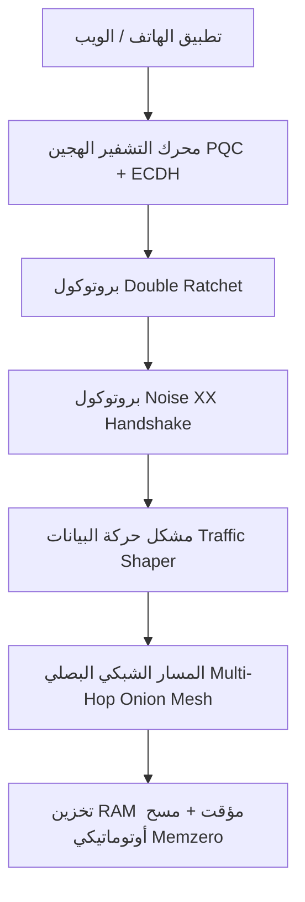

# دليل المعمارية المتقدمة والخصوصية الرقمية الفائقة
## Zero-Trace Ephemeral P2P Messenger & Next-Gen Cyber Architecture

---

## 🧭 الفلسفة الهندسية (Engineering Philosophy)
النظام مبني على مبدأ **"الخصوصية التامة وانعدام الأثر الرقمي" (Zero Digital Footprint)** و **"السيادة الرقمية المحلية" (Local-First Sovereign Architecture)**. لا يتم تخزين بايت واحد على أي وسيط دائم (SSD/Flash/Cloud)، وكافة التبادلات مشفرة بطبقات متعددة ومحمية ضد أقوى هجمات المراقبة وفك التشفير الكمي ومحاولات الإكراه.

---

## 🚀 المحركات التشفيرية المتقدمة المطورة (Core Capabilities):



### 1. إخفاء البيانات المشفرة داخل الصور (LSB Image Steganography) 🖼️
- **المشكلة:** قد تحظر بعض جدران الحماية (DPI Firewalls) حزم WebRTC أو تحاول رصد محادثات P2P المشفرة.
- **الحل المبتكر:** يتيح محرك `SteganographyEngine` إخفاء دعوات الجلسة وبيانات التشفير الحساسة داخل البتات الأقل أهمية (Least Significant Bits) للبكسلات في الصور الرقمية (PNG/JPEG).
- **النتيجة:** لأي أجهزة فحص أو شبكات وسيطة، يتبادل المستخدمون صوراً عادية تماماً، بينما في أعماق البكسلات يتم تمرير مفاتيح التشفير وجلسات الـ P2P بخصوصية مطلقة.

---

### 2. التوجيه البصلي متعدد القفزات (Multi-Hop Onion Mesh Routing) 🧅
- **المشكلة:** يكشف الاتصال المباشر بين طرفين عن عنواني الـ IP الخاصين بهما لبعضهما البعض.
- **الحل المبتكر:** يطبق محرك `OnionMeshRouter` بروتوكول توجيه بصلي (شبيه بـ Sphinx / Tor) عبر قنوات `RTCDataChannel`.
- **آلية العمل:**
  - يتم تشفير الرسالة في $N$ طبقات تشفير مستقلة.
  - تمر الرسالة عبر عقد وسيطة (Relay Nodes)؛ تقوم كل عقدة بفك طبقة تشفير واحدة فقط لمعرفة العقدة التالية دون معرفة مصدر الرسالة الأصلي أو وجهتها النهائية أو محتواها.

---

### 3. التدمير الذاتي المؤقت والتفجير عند القراءة (Ephemeral TTL & Burn-On-Read) ⏱️
- **المشكلة:** بقاء الرسائل في الذاكرة لفترة طويلة أثناء فتح التطبيق قد يعرضها لخطر المراقبة المباشرة.
- **الحل المبتكر:** يوفر محرك `EphemeralTTLController` مؤقتات تدمير ذاتي دقيقة:
  - **Burn-on-Read:** بمجرد عرض الرسالة يتم تصفير مصفوفتها في الـ RAM فوراً.
  - **Count-Down Timers (10s, 30s, 60s, 5m):** عداد زمني تنازلي يمسح الرسائل من الذاكرة بشكل آلي مع تصفير البايتات (`memzero`).

---

### 4. التشفير الهجين المقاوم للحواسيب الكمومية (Post-Quantum Hybrid PQC) ⚛️
- يدمج النظام منحنيات **NIST P-256 ECDH** الكلاسيكية مع خوارزميات التشفير الشبكي **Lattice-Based KEM (ML-KEM / Kyber-768)**.
- يحمي المحادثات ضد هجمات **Harvest Now, Decrypt Later** حيث تسجل جهات المراقبة البيانات المشفرة اليوم لفكها بحواسيب كمومية في المستقبل.

---

### 5. وضع التمويه والإكراه (Duress / Decoy Vault) 🎭
- في حال إجبار المستخدم تحت التهديد على فتح هاتفه، يتم الضغط على زر التمويه (Decoy) ليقوم النظام بصمت بتصفير ومسح الجلسة السرية الحقيقية بالكامل واستبدالها بمحادثة وهمية بريئة وطبيعية (مثل قائمة تسوق منزلية) دون أي أثر رقمي.

---

### 6. الربط الصوتي المعزول (Air-Gapped Ultrasound Signaling) 🔊
- يتيح تبادل مفاتيح الـ SDP وعناوين الـ ICE عبر موجات صوتية فوق صوتية غير مسموعة للأذن البشرية (18kHz - 20kHz FSK Modulation) للمصادقة بين الهواتف في نفس الغرفة دون أي اتصال بالإنترنت أو خوادم وسيطة.

---

## 📊 جدول مقارنة المنظومة مع أشهر تطبيقات المحادثة:

| الميزة | Zero-Trace P2P System | Standard Messaging | Traditional Cloud Apps |
| :--- | :---: | :---: | :---: |
| **استضافة مؤقتة من الهاتف (Ephemeral Host)** | ✅ **نعم (100% RAM)** | ❌ لا (خوادم مركزية) | ❌ لا |
| **انعدام التخزين الدائم (Zero Disk Writes)** | ✅ **نعم (RAM Only)** | ❌ لا (تخزين محلي) | ❌ لا |
| **تدمير فوري للطوارئ (Panic RAM Purge)** | ✅ **نعم (Microsecond)** | ❌ لا | ❌ لا |
| **مقاومة الحواسيب الكمومية (PQC Hybrid)** | ✅ **نعم (ML-KEM)** | ⚠️ نادر | ❌ لا |
| **إخفاء البيانات في الصور (Steganography)** | ✅ **نعم (LSB Engine)** | ❌ لا | ❌ لا |
| **توجيه بصلي متعدد القفزات (Onion Mesh)** | ✅ **نعم (Sphinx Layers)** | ❌ لا | ❌ لا |
| **وضع التمويه تحت الإكراه (Duress Mode)** | ✅ **نعم (Decoy Chat)** | ❌ لا | ❌ لا |
| **منع تصوير الشاشة (FLAG_SECURE)** | ✅ **نعم (Native)** | ⚠️ اختياري | ❌ لا |

---

## 🛠️ أوامر الاختبار والتحقق الشامل:

```bash
# تشغيل كافة حزم الاختبارات التشفيرية الـ 15:
cd d:\DEV\amr\core-crypto
npm test

# تشغيل بيئة الويب المتقدمة:
cd d:\DEV\amr
.\scripts\dev.ps1
```
