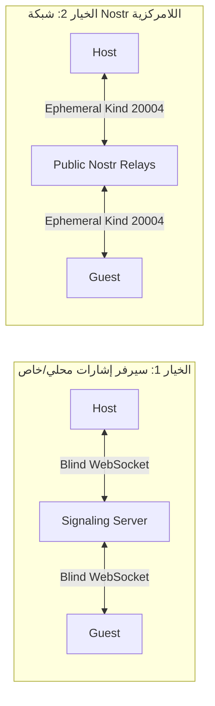

# 🛡️ Zero-Trace P2P Architecture & Security Specification

This document details the architectural design, cryptographic protocols, threat modeling, and operational mechanics of the **Zero-Trace P2P** communication system.

---

## 1. Cryptographic Protocol Specification

### 1.1 Ephemeral Session Handshake
1. **Host Initialization:**
   - Generates high-entropy 256-bit Pre-Shared Key $PSK \leftarrow \text{CSPRNG}(256)$
   - Generates Ephemeral Keypair $(SK_H, PK_H) \leftarrow \text{ECDH-P256}()$
   - Computes Short Authentication String $SAS = \text{Truncate}(\text{SHA-256}(PK_H), 8)$
   - Constructs Invitation URI with Fragment `#`:
     $$\text{URI} = \texttt{https://app.io/join\#sid=UUID\&key=Base64}(PSK)\texttt{\&fp=}SAS$$

2. **Guest Handshake & Key Derivation:**
   - Reads URI fragment via client-side JavaScript / Native code.
   - Generates Guest Ephemeral Keypair $(SK_G, PK_G) \leftarrow \text{ECDH-P256}()$.
   - Derives Root Master Secret:
     $$SS = \text{ECDH}(SK_G, PK_H) = \text{ECDH}(SK_H, PK_G)$$
   - Derives Master Symmetric Encryption Key:
     $$K_{master} = \text{HKDF-SHA256}(\text{salt}=0^{16}, \text{IKM}=SS, \text{info}=\text{"P2P\_LOCAL\_FIRST\_EPHEMERAL\_V1"}, \text{len}=32)$$

### 1.2 Double Ratchet (Message-by-Message PFS)
- To achieve **Perfect Forward Secrecy (PFS)** and **Post-Compromise Security (PCS)**:
  - Each message steps the sending chain key forward:
    $$K_{chain}^{i+1}, K_{msg}^i = \text{HKDF}(K_{chain}^i, \text{info}=\text{"SEND\_STEP\_"} \parallel i)$$
  - Immediately overwrites $K_{chain}^i$ in memory using `sodium_memzero()`.
  - Message Payload encrypted using authenticated cipher:
    $$\text{Ciphertext} = \text{AES-GCM-256}(K_{msg}^i, \text{IV}_{96}, \text{Plaintext})$$

---

## 2. Threat Model & Security Mitigations

| التهديد الأمني (Threat) | ناقل الهجوم (Attack Vector) | آلية الحماية المطبقة (Mitigation) |
| :--- | :--- | :--- |
| **التنصت على خادم الإشارات (Signaling Snooping)** | فحص الحزم المارة عبر خادم الـ WebSockets أو Nostr. | **Zero-Knowledge Envelope:** جميع حزم الـ SDP والـ ICE Candidates مشفرة محلياً بمفتاح $PSK$؛ السيرفر يرى فقط بايتات عشوائية. |
| **تسريب روابط الدعوة (URL Leaks / Proxy Logs)** | تسجيل خوادم الـ Proxy / CDN لعناوين الـ URLs المطلوبة. | **Fragment Identifier (`#`):** ما بعد علامة `#` لا يُرسل مطلقاً في ترويسات الـ HTTP حسب معيار RFC 3986. |
| **هجوم رجل في المنتصف (Man-in-the-Middle - MitM)** | اعتراض وتبديل المفاتيح الأولية. | **Safety Fingerprint (SAS):** مقارنة مرئية فورية لبصمة التشفير الظاهرة في أعلى الشاشة. |
| **فحص الذاكرة المؤقتة (Memory Inspection / RAM Dumps)** | استخراج الذاكرة بعد انتهاء الجلسة للبحث عن الرسائل. | **Zero-Disk Privacy:** عدم الكتابة على القرص نهائياً، استخدام التخزين المؤقت في الـ RAM (`:memory:`)، وتنفيذ `sodium_memzero` عند الإغلاق. |
| **تصوير الشاشة والتطبيقات المفتوحة (Screen Capture)** | برمجيات التجسس أو شاشة Recent Apps في Android. | تفعيل `FLAG_SECURE` وإخفاء الـ Snapshot تلقائياً. |

---

## 3. Decentralized Signaling Options



---

## 4. Coturn Production Deployment (STUN/TURN)

عند تشغيل النظام في بيئة إنتاجية معقدة خلف جدران نارية صارمة (Symmetric NAT):

```conf
# /etc/turnserver.conf
listening-port=3478
tls-listening-port=5349
min-port=49152
max-port=49200
fingerprint
lt-cred-mech
use-auth-secret
static-auth-secret=YOUR_SECURE_AUTH_SECRET_HEX
realm=turn.yourdomain.com
total-quota=100
bps-capacity=0
stale-nonce
no-loopback-peers
no-multicast-peers
```
